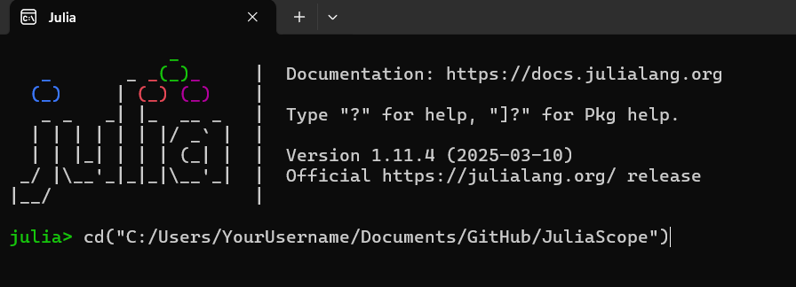
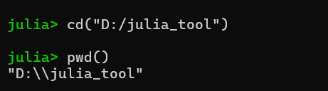
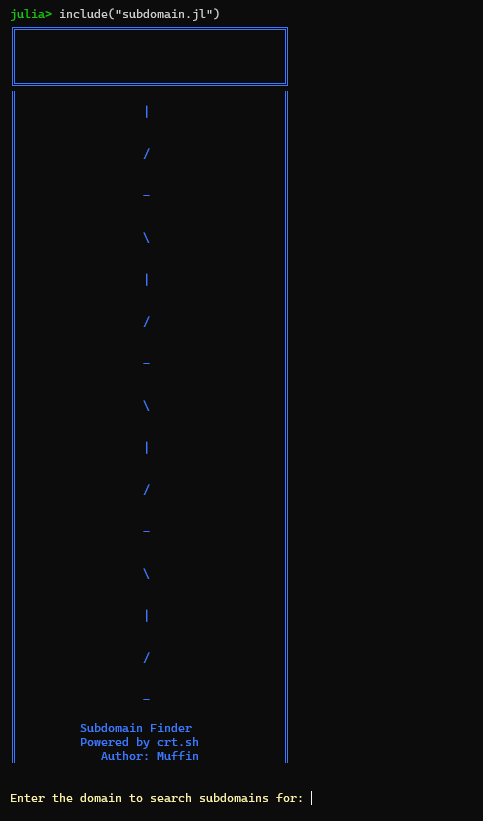
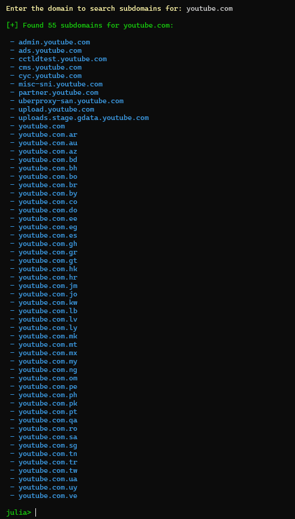

# JuliaScope - Multithreaded Subdomain Recon

JuliaScope is a high-performance, multithreaded subdomain enumeration tool built in Julia. Leveraging `crt.sh` and concurrent processing, it efficiently retrieves subdomains for reconnaissance, making it ideal for security professionals and penetration testers.

## 🚀 Features
- **Parallelized Execution**: Fast, asynchronous querying.
- **Optimized Data Parsing**: Uses `JSON3.jl` for rapid processing.
- **User-Friendly UI**: Colorized output with `Crayons.jl`.
- **Intelligent Filtering**: Removes duplicates and wildcard entries.
- **Lightweight & Efficient**: Minimal system overhead.

## 🛠 Prerequisites
- [Install Julia](https://julialang.org/downloads/)
- Internet connectivity for API queries.

## 📌 Installation
```sh
git clone https://github.com/yourusername/JuliaScope.git
cd JuliaScope
```
```julia
using Pkg
Pkg.add(["HTTP", "JSON3", "Crayons", "ThreadsX"])
```

## 🔧 Usage
1. **Open Julia**
   ```sh
   julia
   ```
   

2. **Navigate to the JuliaScope directory**
   ```julia
   cd("path/to/JuliaScope")
   ```
   

3. **Include the script**
   ```julia
   include("subdomain.jl")
   ```
   

4. **Enter the target domain when prompted**
   - The tool will fetch and display subdomains.
   

## 🔜 Roadmap
- **Standalone CLI**: Linux & Windows compatibility.
- **Shodan API Integration**: Advanced asset fingerprinting.
- **Enhanced Multithreading**: Optimized parallel execution.

## 🛡 Legal & Ethical Use
Use JuliaScope only for legal penetration testing and research. Unauthorized use is prohibited.

---
🖥 **Author**: Mooofin
